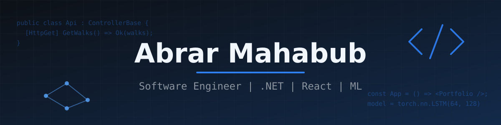
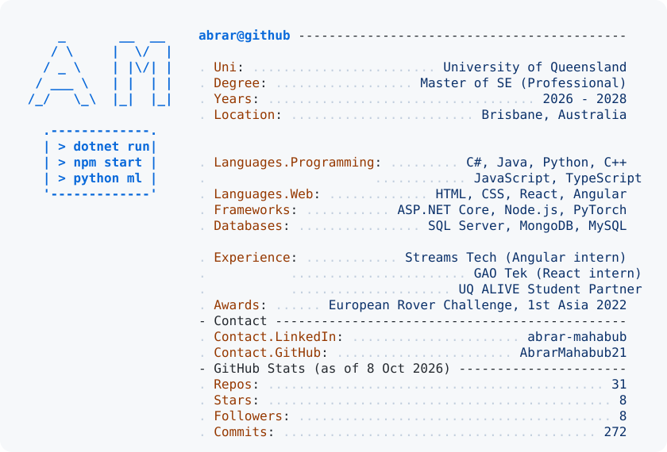

<h1 align="center">Hi, I'm Abrar 👋</h1>

  

  <picture>
    <source media="(prefers-color-scheme: dark)" srcset="./dark_mode.svg" />
    
  </picture>

## About me

- Master of Software Engineering (Professional) student at UQ, Brisbane. Open to software and AI internships.
- I build back end APIs with C# and ASP.NET Core, and web front ends with React and Angular.
- I work with Python for computer vision and machine learning projects.
- I practise data structures and algorithms in C++ on LeetCode and Codeforces.

## Connect with me

  
  

## Languages and tools

  

  
  
  

## GitHub stats

  <picture>
    <source media="(prefers-color-scheme: dark)" srcset="https://github-readme-stats.vercel.app/api/top-langs/?username=AbrarMahabub21&layout=compact&hide_border=true&theme=github_dark&title_color=2F81F7" />
    
  </picture>
  <picture>
    <source media="(prefers-color-scheme: dark)" srcset="https://github-readme-stats.vercel.app/api?username=AbrarMahabub21&show_icons=true&hide_border=true&theme=github_dark&title_color=2F81F7&icon_color=2F81F7" />
    
  </picture>

## Featured projects

| Project | What it is |
|---|---|
| [NZWalks](https://github.com/AbrarMahabub21/NZWalks) | ASP.NET Core Web API for NZ walks and regions with EF Core, SQL Server and JWT auth |
| [StoryVerse](https://github.com/AbrarMahabub21/StoryVerse) | Node.js and Express app for public and private stories, with MongoDB and Google login |
| [Portfolio](https://github.com/AbrarMahabub21/Portfolio) | My portfolio site made with React, Vite, Tailwind and Three.js |
| [HandTrackingMotion](https://github.com/AbrarMahabub21/HandTrackingMotion) | Tracks 21 hand landmarks in real time with MediaPipe and OpenCV |
| [JARVIS](https://github.com/AbrarMahabub21/JARVIS) | Python voice assistant: speech to text, OpenAI chat, text to speech |
